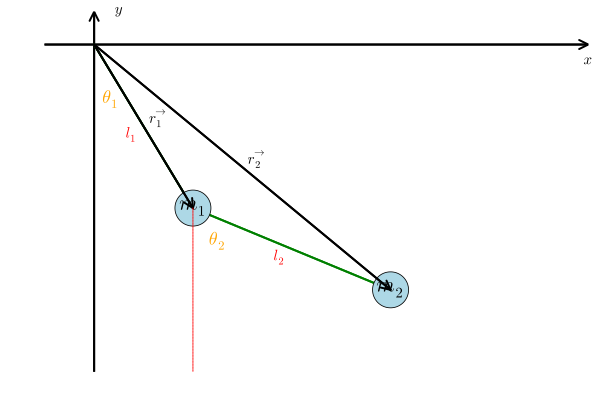

# Calcule de la position

## Shema

## équations - Positions
$\frac{x_1}{l_1}=sin(\theta_1)$

$x_1 = l_1 sin(\theta_1)$

$\frac{y_1}{l_1}=cos(\theta_1)$

$y_1 = - l_1 cos(\theta_1)$

$x_2 = x_1 + l_2 sin(\theta_2)$

$x_2 = l_1 sin(\theta_1) + l_2 sin(\theta_2)$

$y_2  = y_1 - l_2 cos(\theta_2)$

$y_2 = - l_1 cos(\theta_1) - l_2 cos(\theta_2)$

### Résumé
$x_1(t) = l_1 sin(\theta_1(t))$

$y_1(t) = -l_1 cos(\theta_1(t))$

$x_2(t) = l_1 sin(\theta_1(t)) + l_2 sin(\theta_2(t))$

$y_2(t) = -l_1 cos(\theta_1(t)) - l_2 cos(\theta_2(t))$

## équations - Vitesse
$v_{x1} = \frac{dx_1}{dt} = \frac{d}{dt}[l_1 sin(\theta_1(t))] = l_1 cos(\theta_1(t))\dot{\theta_1}(t)$

$v_{y1} = \frac{dy_1}{dt} = -l_1 sin(\theta_1(t))\dot{\theta_1}(t)$

$v_{x2} = \frac{dx_2}{dt} = \dot{x_1} + l_2 cos(\theta_2(t))\dot{\theta_2}(t) = l_1 cos(\theta_1(t))\dot{\theta_1}(t) + l_2 cos(\theta_2(t))\dot{\theta_2}(t)$

$v_{y2} = \frac{dy_2}{dt} = \dot{y_1} - l_2 sin(\theta_2(t))\dot{\theta_2}(t) = -l_1 sin(\theta_1(t))\dot{\theta_1}(t) - l_2 sin(\theta_2(t))\dot{\theta_2}(t)$

### Résumé

$v_{x1}(t) = l_1 cos(\theta_1(t))\dot{\theta_1}(t)$

$v_{y1}(t) = -l_1 sin(\theta_1(t))\dot{\theta_1}(t)$

$v_{x2}(t) = l_1 cos(\theta_1(t))\dot{\theta_1}(t) + l_2 cos(\theta_2(t))\dot{\theta_2}(t)$

$v_{y2}(t) = -l_1 sin(\theta_1(t))\dot{\theta_1}(t) - l_2 sin(\theta_2(t))\dot{\theta_2}(t)$

## équations - accélération

$a_{x1}(t) = -l_1 sin(\theta_1(t))\dot{\theta_1}(t)^2 + l_1 cos(\theta_1(t))\ddot{\theta_1}(t)$

$a_{y1}(t) = -l_1 cos(\theta_1(t))\dot{\theta_1}(t)^2 -l_1 sin(\theta_1(t))\ddot{\theta_1}(t)$

$a_{x2}(t) = \ddot{x_1}(t) - l_2 sin(\theta_2(t))\dot{\theta_2}(t)^2 + l_2 cos(\theta_2(t))\ddot{\theta_2}(t) =-l_1 sin(\theta_1(t))\dot{\theta_1}(t)^2 + l_1 cos(\theta_1(t))\ddot{\theta_1}(t) - l_2 sin(\theta_2(t))\dot{\theta_2}(t)^2 + l_2 cos(\theta_2(t))\ddot{\theta_2}(t)$

$a_{y2}(t) = \ddot{y_1}(t) -l_2 cos(\theta_2(t))\dot{\theta_2}(t)^2 -l_2 sin(\theta_2(t))\ddot{\theta_2}(t) =-l_1 cos(\theta_1(t))\dot{\theta_1}(t)^2 -l_1 sin(\theta_1(t))\ddot{\theta_1}(t) -l_2 cos(\theta_2(t))\dot{\theta_2}(t)^2 -l_2 sin(\theta_2(t))\ddot{\theta_2}(t)$

### Résumé

$a_{x1}(t) = -l_1 sin(\theta_1(t))\dot{\theta_1}(t)^2 + l_1 cos(\theta_1(t))\ddot{\theta_1}(t)$

$a_{y1}(t) = -l_1 cos(\theta_1(t))\dot{\theta_1}(t)^2 -l_1 sin(\theta_1(t))\ddot{\theta_1}(t)$

$a_{x2}(t) = -l_1 sin(\theta_1(t))\dot{\theta_1}(t)^2 + l_1 cos(\theta_1(t))\ddot{\theta_1}(t) - l_2 sin(\theta_2(t))\dot{\theta_2}(t)^2 + l_2 cos(\theta_2(t))\ddot{\theta_2}(t)$

$a_{y2}(t) = -l_1 cos(\theta_1(t))\dot{\theta_1}(t)^2 -l_1 sin(\theta_1(t))\ddot{\theta_1}(t) -l_2 cos(\theta_2(t))\dot{\theta_2}(t)^2 -l_2 sin(\theta_2(t))\ddot{\theta_2}(t)$

## équations - Forces

$T_1(t) =$ Tension de la tige 1 allant du pivot à m1

$u_1(t) = \begin{pmatrix} sin(\theta_1(t)) \\ cos(\theta_1(t)) \end{pmatrix} =$ Vecteur unitaire de T1

$T_2(t) =$ Tension de la tige 1 allant de m1 à m2

$u_2(t) = \begin{pmatrix} sin(\theta_2(t)) \\ cos(\theta_2(t)) \end{pmatrix} =$ Vecteur unitaire de T2

$\vec{g} = (0, -g)$

$\sum{\overrightarrow{F}} = m \overrightarrow{a}$

$m_1 \overrightarrow{a_1}(t) = -T_1(t)u_1(t) + T_2(t)u_2(t) + m_1\vec{g}$

$m_2 \overrightarrow{a_2} = - T_2(t)u_2(t) + m_2\vec{g}$

## Résolution

$m_1 a_{x1} = -T_1 sin(\theta_1) + T_2 sin(\theta_2)$

$m_1 a_{y1} = -T_1 cos(\theta_1) + T_2 cos(\theta_2) -m_1 g$

$m_2 a_{x2} = -T_2 sin(\theta_2)$

$m_2 a_{y2} = - T_2 cos(\theta_2) -m_2g$

$m_1 (-l_1 sin(\theta_1(t))\dot{\theta_1}(t)^2 + l_1 cos(\theta_1(t))\ddot{\theta_1}(t)) = -T_1 sin(\theta_1) + T_2 sin(\theta_2)$

$m_1 ( -l_1 cos(\theta_1(t))\dot{\theta_1}(t)^2 -l_1 sin(\theta_1(t))\ddot{\theta_1}(t)) = -T_1 cos(\theta_1) + T_2 cos(\theta_2) -m_1 g$

$m_2 (-l_1 sin(\theta_1(t))\dot{\theta_1}(t)^2 + l_1 cos(\theta_1(t))\ddot{\theta_1}(t) - l_2 sin(\theta_2(t))\dot{\theta_2}(t)^2 + l_2 cos(\theta_2(t))\ddot{\theta_2}(t)) = -T_2 sin(\theta_2)$

$m_2 a_(-l_1 cos(\theta_1(t))\dot{\theta_1}(t)^2 -l_1 sin(\theta_1(t))\ddot{\theta_1}(t) -l_2 cos(\theta_2(t))\dot{\theta_2}(t)^2 -l_2 sin(\theta_2(t))\ddot{\theta_2}(t)) = - T_2 cos(\theta_2) -m_2g$

$T_2 = -\frac{m_2 a_{x2}}{sin(\theta_2)}$

## équations finales

$\dot{\omega}_1 = \frac{- g (2 m_1 + m_2) \sin\theta_1- m_2 g \sin(\theta_1 - 2\theta_2)- 2 \sin(\theta_1-\theta_2) m_2 (\omega_2^2 l_2 + \omega_1^2 l_1 \cos(\theta_1-\theta_2))}{l_1 (2 m_1 + m_2 - m_2 \cos(2\theta_1 - 2\theta_2))}$

$\dot{\omega}_2 = \frac{2 \sin(\theta_1-\theta_2) \big( \omega_1^2 l_1 (m_1 + m_2) + g (m_1 + m_2) \cos\theta_1 + \omega_2^2 l_2 m_2 \cos(\theta_1-\theta_2) \big)}{l_2 (2 m_1 + m_2 - m_2 \cos(2\theta_1 - 2\theta_2))}$

$\omega_1(t + \Delta t) = {\omega_1}(t) + \Delta t (\frac{- g (2 m_1 + m_2) \sin\theta_1- m_2 g \sin(\theta_1 - 2\theta_2)- 2 \sin(\theta_1-\theta_2) m_2 (\omega_2^2 l_2 + \omega_1^2 l_1 \cos(\theta_1-\theta_2))}{l_1 (2 m_1 + m_2 - m_2 \cos(2\theta_1 - 2\theta_2))})$

${\omega_2}(t + \Delta t) = {\omega_2}(t) + \Delta t (\frac{2 \sin(\theta_1-\theta_2) \big( \omega_1^2 l_1 (m_1 + m_2) + g (m_1 + m_2) \cos\theta_1 + \omega_2^2 l_2 m_2 \cos(\theta_1-\theta_2) \big)}{l_2 (2 m_1 + m_2 - m_2 \cos(2\theta_1 - 2\theta_2))})$

${\theta_1}(t + \Delta t) = {\theta_1}(t) + \Delta t {\omega_1}(t)$

${\theta_2}(t + \Delta t) = {\theta_2}(t) + \Delta t {\omega_2}(t)$

$x_1(t) = l_1 sin(\theta_1(t))$

$y_1(t) = -l_1 cos(\theta_1(t))$

$x_2(t) = l_1 sin(\theta_1(t)) + l_2 sin(\theta_2(t))$

$y_2(t) = -l_1 cos(\theta_1(t)) - l_2 cos(\theta_2(t))$